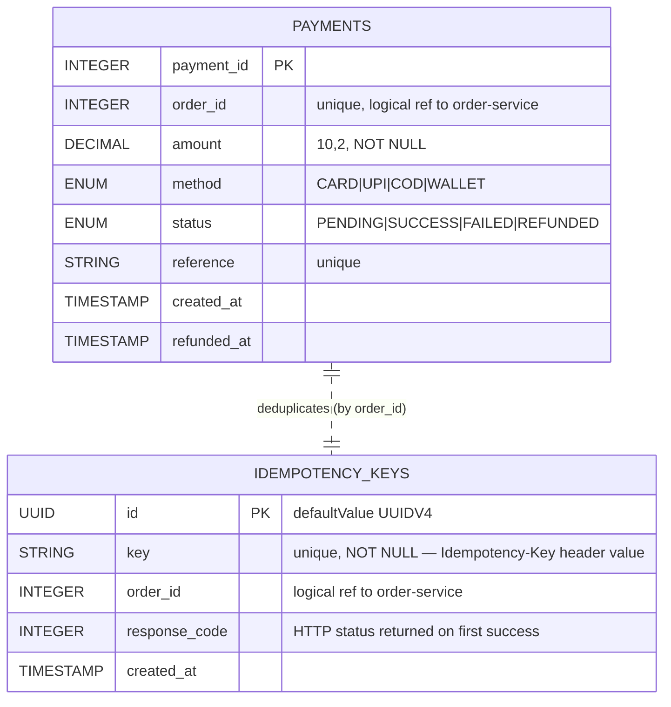

# Payment Service — ER Diagram

**Database:** `payment_db` (PostgreSQL via Sequelize)
**Tables:** `payments`, `idempotency_keys`

## Keys & constraints

| Table | PK | Unique | NOT NULL | Enums |
|---|---|---|---|---|
| `payments` | `payment_id` | `order_id`, `reference` | `order_id`, `amount`, `method`, `status` | `method`, `status` |
| `idempotency_keys` | `id` (UUID) | `key` | `key` | — |

## Integrity

- **No DB-level FK** between `payments` and `idempotency_keys` — they're joined at the app layer on `order_id` (`payment.service.js` `charge()`).
- **One payment per order:** `payments.order_id` has a unique index. Attempting to charge an order that already has a `SUCCESS` payment returns `PAYMENT_ALREADY_EXISTS` 409.
- **Idempotency:** clients MUST send `Idempotency-Key` header on `POST /charge`. Replays of the same key return the original payment instead of re-charging.

## Business rules enforced here

- **COD → PENDING, else SUCCESS:** `status = method === "COD" ? "PENDING" : "SUCCESS"`.
- **Refund guard:** only `SUCCESS` payments can be refunded; double-refund blocked via `PAYMENT_ALREADY_REFUNDED` 409.
- On refund/charge, payment-service calls order-service `PATCH /orders/:id/payment-status` to keep the order's denormalized `payment_status` in sync.

## Cross-service references (logical, no DB FK)

| Column | Owning service | Used for |
|---|---|---|
| `payments.order_id` | order-service | identifies which order is being charged |
| `idempotency_keys.order_id` | order-service | replay resolution |

## Published facts (consumed by others)

- Payment `status` transitions → order-service (`payment_status` column on orders is updated via HTTP call).
- `PAYMENT_SUCCESS` / `PAYMENT_FAILED` events → notification-service (fire-and-forget HTTP POST).
